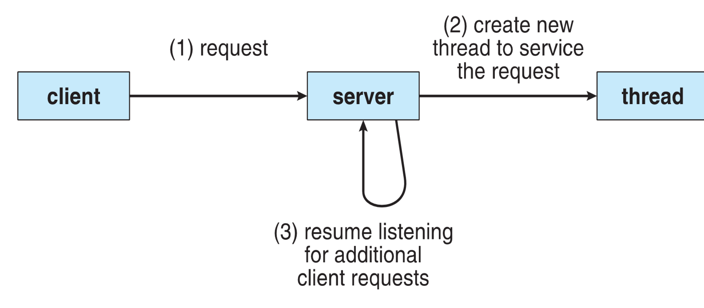
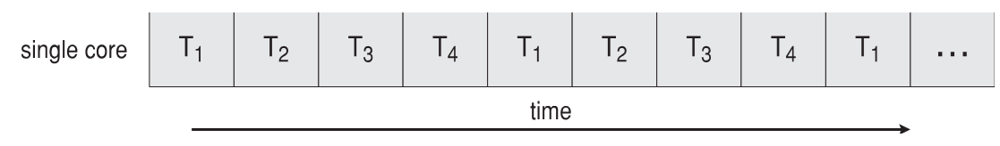

---
tags:
  - operating-systems
---

# Multicore Programming

## Motivation

Most modern applications are multithreaded.
Threads run within the application.
Threads are a subset of processes. *Threads can be considered as a light-weight process.*

> Threads are a path of execution within a process.

Multiple tasks with the application can be implemented by separate threads.
- Update display
- Fetch data
- Spell checking
- Answer a network request

Process creation is heavy-weight while thread creation is light-weight.
Can simplify code and increase efficiency.
Kernels are generally multithreaded.

## Multithreaded Server Architecture



## Benefits

**Responsiveness**: May allow continued execution if part of a process is blocked, especially important for user interfaces.

**Resource Sharing**: Threads share resources of a process, easier than shared memory or message passing.

**Economy**: Cheaper than process creation, thread switching lower overhead than context switching.
- Cheaper in terms of performance (*CPU cycles* and *memory*).

**Scalability**: Process can take advantage of multiprocessor architectures.

## Multicore Programming

**Multicore** or **multiprocessor** systems putting pressure on programmers, challenges include:
- Dividing activities
- Balance
- Data splitting
- Data dependency
- Testing and debugging

***Parallelism*** implies a system can perform more than one task simultaneously.
**Concurrency** supports more than one task making progress.
- Single processor / core, scheduler providing concurrency.

Types of parallelism
- **Data parallelism**: Distributes subsets of the same data across multiple cores, with same operations on each subset of the data.
- **Task parallelism**: Distributing threads across cores. each thread performing a unique operation.

As the number of threads grows, so does architectural support for threading.
- CPUs have cores as well as **hardware threads**.
- Consider *Oracle SPARC T4* with 8 cores, and 8 hardware threads per core. 

> What is the definition of a hardware thread?

## Concurrency vs. Parallelism

**Concurrent execution on a single-core system**



**Parallelism on a multi-core system**


## Single and Multithreaded Process


## Amdahl's Law

Identifies performance gains from adding additional cores to an application that has both serial and parallel components.
- $S$ is serial portion
- $N$ is processing cores

$$speedup\le \frac{1}{S+(\frac{1-S}{N})}$$

That is, if an application is $75\%$ parallel and $25\%$ serial, moving from $1$ to $2$ cores results in speedup of $1.6$ times.
As $N$ approaches $\infty$, the speedup approaches $\frac{1}{S}$.

**Serial portion of an application has disproportionate effect on performance gained by adding additional cores**.

> But does this law take into account multicore systems?

## User Threads and Kernel Threads

**User threads**: Management done by user-level threads library.
Three primary thread libraries:
- POSIX **Pthreads**
- Windows threads
- Java threads

**Kernel threads**: Supported by the Kernel
Virtually all general purpose operating systems include *kernel threads*.

# Multithreading Models

## Many-to-One

Many user-level threads mapped to a single kernel thread.
One thread blocking causes all to block.
Multiple threads may not run in parallel on multicore systems because only one thread may be in the kernel at a time.
Few systems use this model.
Examples:
- **Solaris Green Threads**
- **GNU Portable Threads**


## One-to-One

Each user-level thread maps to a kernel thread.
Creating a user-level thread creates a kernel thread.
More concurrency than many-to-one.
Number of threads per process sometimes restricted due to overhead.
Examples:
- **Windows**
- **Linux**
- **Solaris 9 and later**


## Many-to-Many

Allows many user level threads to be mapped to many kernel threads.
Allows the operating system to create a sufficient number of kernel threads.
Examples:
- **Solaris prior to version 9**
- **Windows with the *ThreadFiber* package***


## Two-level Model

Similar to many-to-many, except that it allows a user thread to be **bound** to a kernel thread.


# Thread Libraries

**Thread library** provides programmers with an API for creating and managing threads.
Two primary keys of implementing
- Library entirely in user space
- Kernel-level library supported by the OS

## Pthreads

May be provided either as a user-level or kernel-level.
A POSIX standard (IEEE 1003.1c) API for thread creation and synchronization.
**Specification**, not **implementation**.
API specifies the behavior of the thread library, implementation is up to development of the library.
Common in UNIX operating systems (Solaris, Linux, Mac OS X).

### Pthreads Example

```C
#include <pthread.h>
#include <stdio.h>

int sum; /* this data is shared by the thread(s) */
void *runner(void *param); /* threads call this function */

int main(int argc, char *argv[])
{
	pthread_t tid; /* the thread identifier */
	pthread_attr_t attr; /* set of thread attributes */
	
	if (argc != 2) {
		fprintf(stderr, "usage: a.out <integer value>\n") ;
		return -1;
	}
	
	if (atoi(argv[1]) < 0) {
		fprintf(stderr, "%d must be >= O\n", atoi(argv[1]));
		return -1;
	}
	
	/* get the default attributes */
	pthread_attr_init(&attr);
	/* create the thread */
	pthread_create(&tid, &attr, runner, argv[1]);
	/* wait for the thread to exit */
	pthread_join(tid, NULL);
	
	printf ("sum = %d\n", sum);
}

/* The thread will begin control in this function */
void *runner (void *param)
{
	int i, upper = atoi(param);
	sum = 0;
	
	for (i = 1; i <= upper; i++)
		sum += i;
	
	pthread_exit(0);
}
```

### Pthreads Code for Joining 10 Threads

```C
#define NUM_THREADS 10

/* an array of threads to be joined upon */
pthread_t workers [NUM_THREADS];

for (int i = O; i < NUM_THREADS; i++)
	pthread_join(workers[i], NULL);
```

# Implicit Threading

*Implicit threading* is growing in popularity as numbers of threads increase.
Program correctness is more difficult with explicit threads.

Creation and management of threads done by compilers and run-time libraries rather than programmers.

Three methods explores:
- Thread Pools
- OpenMP
- Grand Central Dispatch

Other methods include Microsoft Threading Building Blocks (TBB), `java.util.concurrent` package, etc.

## OpenMP

Set of compiler directives and an API for C, C++, FORTRAN.
Provides support for parallel programming in shared-memory environments.
Identifies **parallel regions** - blocks of code that can run in parallel.

`#pragma omp parallel`
Creates as many threads as there are cores.

```C
#pragma omp parallel for

for (i = 0; i < N; i++)
{
	c[i] = a[i] + b[i];
}
```
Run for loop in parallel.

# Threading Issues

## `fork()` and `exec()` system calls

Does `fork()` duplicate only the calling thread or all threads?
- Some UNIXs have two versions of fork.

`exec()` usually works as normal - replace the running process including all threads.

## Signal Handling

**Signals** are used in UNIX systems to notify a process that a particular event has occurred.
A **signal handler** is used to process signals
1. Signal is generated by particular event
2. Signal is delivered to a process
3. Signal is handled by one of two signal handlers:
	1. default
	2. user-defined

Every signal has a **default handler** that kernel runs when handling signals.
- **User-defined signal handler** can override the default one.
- For single-threaded, signal delivered to process.

Where should a signal be delivered for multi-threaded?
- Deliver the signal to the thread to which the signal applies.
- Deliver the signal to every thread in the process.
- Deliver the signal to certain threads in the process.
- Assign a specific thread to receive all signals for the process.

### Example

Suppose you have `printf()` statements for debugging purposes. You would like to keep the `printf()` statements for future updates, but you do not want the program to print debugging statements before deploying the current version.

```C
...
bool debug = FALSE;
if (debug) {
	...
	printf(...);
	...
}
...
```

You can send a signal for debugging using the `kill` command.

`kill -s <signal> -p <pid>`
`kill -s debug -p <pid>`

## Thread cancellation

Terminating a thread before it has finished.
Thread to be canceled is the **target thread**.
Two general approaches:
- **Asynchronous cancellation** terminates the target thread immediately.
- **Deferred cancellation**

Invoking thread cancellation requests cancellation, but actual cancellation depends on the thread state.

| Mode         | State    | Type         |
| ------------ | -------- | ------------ |
| Off          | Disabled | -            |
| Deferred     | Enabled  | Deferred     |
| Asynchronous | Enabled  | Asynchronous |

If thread has cancellation disabled, cancellation remains pending until threads enables it.
Default type is *deferred*.
- Cancellation only occurs when the thread reaches **cancellation point**.
	- i.e. `pthread_testcancel()`
	- then the **cleanup handler** is invoked.

## Thread-local storage

**Thread-local storage** (**TLS**) allows each thread to have its own copy of data.
Useful when you do not have control of the thread creation (i.e., when using a thread pool).
Different from local variables
- Local variables visible only during single function invocation.
- *TLS* visible across function invocations.

Similar to `static` data type
- *TLS* is unique to each thread.

## Scheduler Activations

Both [[Threads and Concurrency - CS324#Multithreading Models|M:M and Two-level models]] require communication to maintain the appropriate number of kernel threads allocated to the application.
Typically uses an intermediate data structure between user and kernel threads called the **lightweight process** (**LWP**).
- Appears to be a virtual processer on which a process can schedule user thread to run.
- Each *LWP* is attached to a kernel thread.
- How many *LWP*s to create?

Scheduler activations provide **upcalls** - a communication mechanism from the kernel to the **upcall handler** in the thread library.
This communication allows an application to maintain the correct number of kernel threads.

# Operating System Examples

## Linux Threads

Linux refers to them as **tasks** rather than **threads**.
Thread creation is done through the `clone()` system call.
`clone()` allows a child task to share the address space of the parent task (process).

Flags control behavior

| flag            | meaning                            |
| --------------- | ---------------------------------- |
| `CLONE_FS`      | File-system information is shared. |
| `CLONE_VM`      | The same memory space is shared.   |
| `CLONE_SIGHAND` | Signal handlers are shared.        |
| `CLONE_FILES`   | The set of open files is shared.   |
